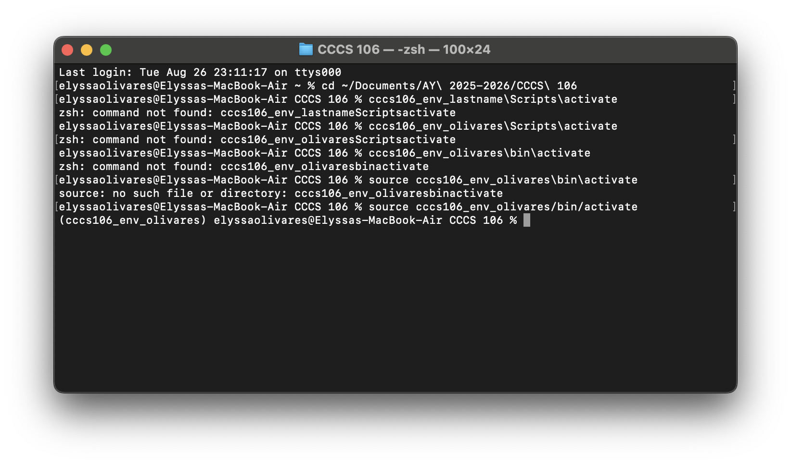
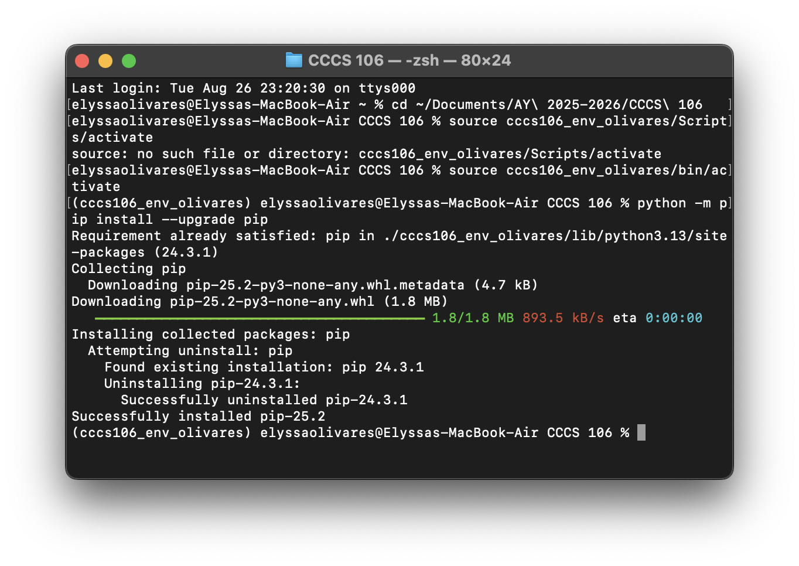
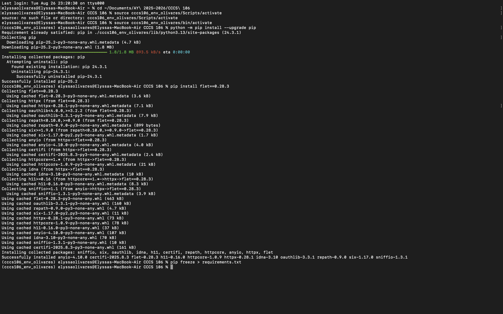
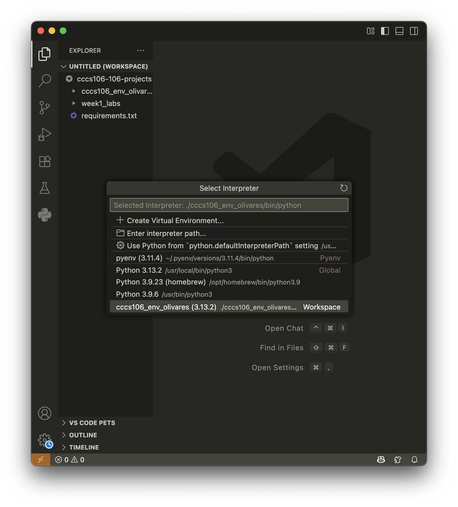
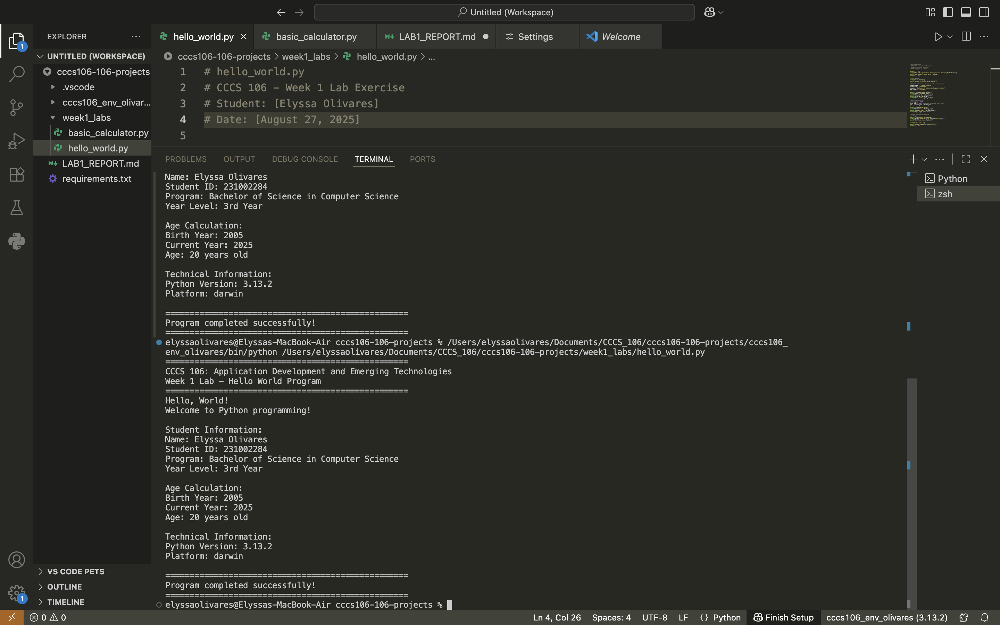
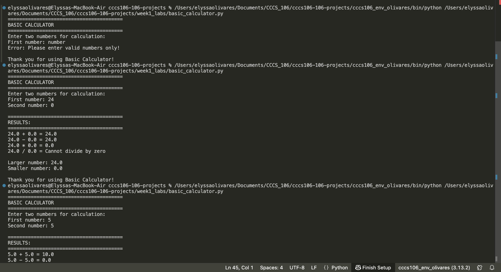

Create LAB1_REPORT.md:

# Lab 1 Report: Environment Setup and Python Basics

**Student Name:** Elyssa Olivares\
**Student ID:** 231002284\
**Section:** BSCS 3B\
**Date:** August 27, 2025

## Environment Setup

### Python Installation
- **Python Version:** 3.13.2
- **Installation Issues:** Actually I had no experience in having troubles in installation of python or python versions as it was already installed. There is a confusion in looking for python versions as I have different versions instaled. In terms of installing different desired version, I can just use the command using Hombrew or 'brew' command for example, 'brew install python'. 
- **Virtual Environment Created:** ✅ cccs106_env_olivares

### VS Code Configuration
- **VS Code Version:** [1.103]
- **Python Extension:** ✅ Installed and configured
- **Interpreter:** ✅ Set to cccs106_env_olivares/bin/python.exe   -- My interpreter used 'bin' sins that's where the 'activate' located 

### Package Installation
- **Flet Version:** 0.28.3
- **Other Packages:** None

## Programs Created

### 1. hello_world.py
- **Status:** ✅ Completed
- **Features:** Student info display, age calculation, system info
- **Notes:** I don not have any problems encountered during running and creating the file. I just changed the name, student id, date, and year level. I am somehow amazed that I am able to use the virtual envronment that I made.

### 2. basic_calculator.py
- **Status:** ✅ Completed
- **Features:** Basic arithmetic, error handling, min/max calculation
- **Notes:** Similar to the first one, I did not also experienced any bugs and errors in running the code. I noticed the conditions in terms of rules for inputs and those are good.

## Challenges and Solutions

The dificulties that I had encountered in implementing these tasks are only minimal. I experience having trouble in tracking the paths for my folder as my operating system has different approach in commands and syntax. I also had troubles in creating some files and had a confusion in making the workspace (haha). 

## Learning Outcomes

All in all, the activity is great and interesting. I actually enjoyed doing it. I have learned a lot and most of those are just a recap from my old course requirements. This makes me more familiar of the syntax in my OS for manuevering commands in my terminal. 

## Screenshots

**Environment Set Up**

**Upgrading Pip**

**Installing Flet**

**VS Code Set Up**

**Hello World Output**

**Basic CalculatorOutput**

